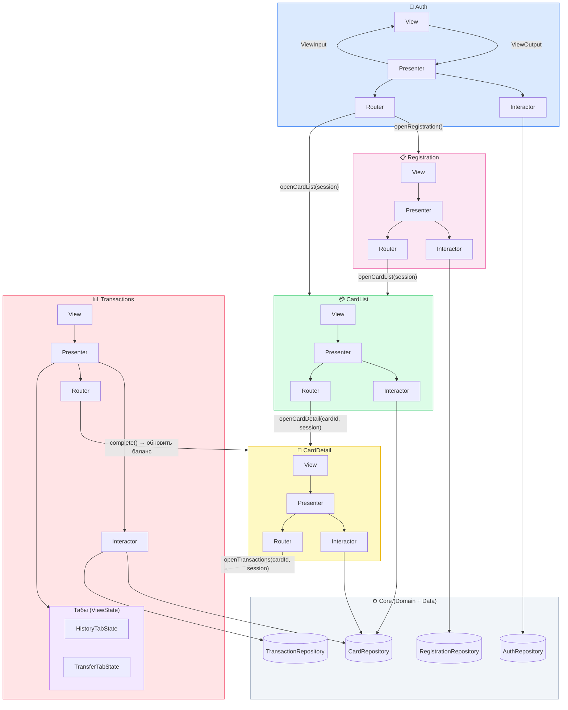

# ApexBank

## Лабораторная №6 — дизайн-система

### Ссылка на дизайн-систему в Figma
(вставьте ссылку сюда)

### Дополнительно
- Реализована тёмная тема и переключение темы (light/dark) через кнопку в navigation bar на каждом экране.

### Где лежит дизайн-система
`apexbank/DesignSystem/`

Структура:
- `DesignSystem/Tokens/` — токены (цвета/типографика/отступы)
- `DesignSystem/Components/` — переиспользуемые UI-компоненты
- `DesignSystem/Extensions/` — утилиты (например hex → UIColor)

### Токены (минимум)

#### Colors
Лежат в `DesignSystem/Tokens/DSColors.swift` и основаны на Figma tokens.

Есть:
- `DS.Colors.primary` (#CD2062FF)
- `DS.Colors.secondary` (#D1D1D1FF)
- `DS.Colors.background` (light/dark)
- `DS.Colors.surface` (light/dark)
- `DS.Colors.textPrimary` (light/dark)
- `DS.Colors.textSecondary` (light/dark)
- `DS.Colors.error` (#FF4D4DFF)

Цвета поддерживают формат `#RRGGBB` и `#RRGGBBAA`.

#### Typography
Лежит в `DesignSystem/Tokens/DSTypography.swift`.

Поддерживаются стили из Figma:
- `title1` (Audiowide 32)
- `title2` (Gloock 16)
- `body` (Host Grotesk 16)
- `button` (Host Grotesk 16, bold)
- `caption` (Host Grotesk 12, bold)
- `text12` (Host Grotesk 12)

Если кастомный шрифт не добавлен в проект, используется fallback на `.systemFont`.

#### Spacing
Лежит в `DesignSystem/Tokens/DSSpacing.swift`.

Есть:
- `xs/s/m/l/xl` (4/8/16/24/32)
- `cornerRadius` (12)

### Компоненты (минимум 3)
Лежат в `DesignSystem/Components/`:
1) `DSButton` — унифицированная primary-кнопка, стиль фиксирован внутри компонента
2) `TextStyle` + `UILabel.apply(_:)` — централизованное применение шрифтов/цветов
3) `DSStateView` — отображение `loading / empty / error (+retry)`

Дополнительно:
- `DSThemeToggleButton` — маленькая круглая кнопка (sun/moon) для переключения light/dark в navigation bar

### Где применено
- Экран авторизации: `Modules/Auth/AuthViewController.swift`
- Экран списка карт: `Modules/CardList/CardListViewController.swift`

### Состояния экрана (loading/empty/error) через компонент
`CardListViewController` использует `DSStateView`:
- `.loading(text:)`
- `.empty(text:)`
- `.error(text:buttonTitle:)` (кнопка `Повторить`)

---

## Лабораторная №5 — экран списка (UIKit)

### Подход к списку
Используется **UITableView** + отдельный менеджер `CardListTableManager`.

ViewController не разрастается: `UITableViewDataSource/Delegate` вынесены в менеджер

### Что отображается в списке
Формат строки:
`<Тип> **** <последние 4> | <Владелец> `

Пример:
`Visa **** 4081 | IVAN IVANOV | 125000.50`

По tap открывается заглушка деталей. Заголовок деталей:
`Visa | **** 4081`

### Состояния экрана
Экран умеет показывать:
- `loading` — индикатор загрузки
- `content(items)` — таблица
- `empty` — текст "Пусто"
- `error(message)` — текст ошибки + кнопка "Повторить"


### Как увидеть loading/content/empty/error через echo-сервер
`https://alfaitmo.ru/server/echo/408099/cards/list`

Чтобы показать разные состояния, можно отправлять разные ответы.

Пример:
```json
{
  "cards": [
    {
      "id": "1",
      "card_number": "4081991234564081",
      "cardholder_name": "IVAN IVANOV",
      "expiry_date": "09/27",
      "card_type": "Visa",
      "balance": 125000.50,
      "is_active": true
    }
  ]
}
```

#### Empty (пустой список)
```json
{
  "cards": []
}
```

#### Error (ошибка)
Самый простой способ — вернуть HTTP статус не из 2xx, например **500** или **404** (приложение покажет `error`).

---

## Архитектура: VIPER

### Обоснование

Почему VIPER подходит:

- Банковское приложение сложное: много экранов, бизнес-логика (переводы, счета, лимиты), работа с абстракциями — VIPER хорошо справляется с такой сложностью
- Чёткое разделение слоёв делает код тестируемым
- Все зависимости через протоколы
- Router выделен отдельно, что важно для банка с его сложной навигацией (авторизация → главная → карты → детали транзакции)
---

## Навигационный флоу

```
┌───────────────────────────────────────────────────┐
│                    Старт приложения               │
│          Auth пробует восстановить сессию         │
└──────────────────────┬────────────────────────────┘
                       │
          ┌────────────▼────────────┐
          │         Auth            │  Вход: —
          │  phone + password       │  Выход: session (UserSession)
          └──────┬──────────┬───────┘
                 │          │
         успех   │          │ нет аккаунта
                 │          └─────────────────┐
    ┌────────────▼──┐                    ┌────▼────────────────┐
    │   CardList    │   успех → CardList │    Registration     │  Вход: —
    │               │◀────────────────── │  fullName/phone/pw  │  Выход: session
    └───────┬───────┘                    └────────┬────────────┘
            │                    
    (cardId, session)           
            │                   
    ┌───────▼───────┐           
    │  CardDetail   │ 
    │               │  Вход: cardId, session
    └───────┬───────┘  Выход: → cardId
            │
    (cardId, session)
            │
    ┌───────▼───────┐
    │ Transactions  │  Вход: cardId, session
    │               │  Выход: — (конечный экран)
    └───────────────┘
```

---


## Диаграмма зависимостей


**Правило:** зависимости идут только вниз по слоям.  
`View → Presenter → Interactor → Repository`.  
Data-слой не знает о Presentation. Domain не знает об UIKit.
