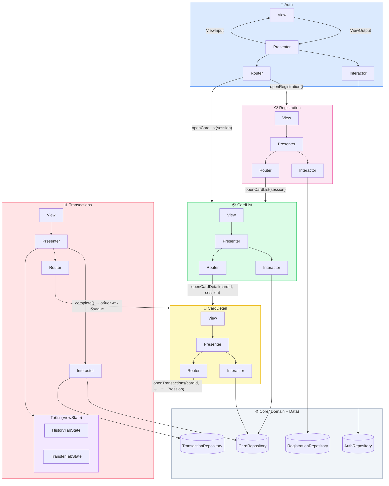

## Архитектура: VIPER

### Обоснование

Почему VIPER подходит:

- Банковское приложение сложное: много экранов, бизнес-логика (переводы, счета, лимиты), работа с абстракциями — VIPER хорошо справляется с такой сложностью
- Чёткое разделение слоёв делает код тестируемым
- Все зависимости через протоколы
- Router выделен отдельно, что важно для банка с его сложной навигацией (авторизация → главная → карты → детали транзакции)
---

## Навигационный флоу

```
┌───────────────────────────────────────────────────┐
│                    Старт приложения               │
│          Auth пробует восстановить сессию         │
└──────────────────────┬────────────────────────────┘
                       │
          ┌────────────▼────────────┐
          │         Auth            │  Вход: —
          │  phone + password       │  Выход: session (UserSession)
          └──────┬──────────┬───────┘
                 │          │
         успех   │          │ нет аккаунта
                 │          └─────────────────┐
    ┌────────────▼──┐                    ┌────▼────────────────┐
    │   CardList    │   успех → CardList │    Registration     │  Вход: —
    │               │◀────────────────── │  fullName/phone/pw  │  Выход: session
    └───────┬───────┘                    └────────┬────────────┘
            │                    
    (cardId, session)           
            │                   
    ┌───────▼───────┐           
    │  CardDetail   │ 
    │               │  Вход: cardId, session
    └───────┬───────┘  Выход: → cardId
            │
    (cardId, session)
            │
    ┌───────▼───────┐
    │ Transactions  │  Вход: cardId, session
    │               │  Выход: — (конечный экран)
    └───────────────┘
```

---


## Диаграмма зависимостей


**Правило:** зависимости идут только вниз по слоям.  
`View → Presenter → Interactor → Repository`.  
Data-слой не знает о Presentation. Domain не знает об UIKit.
